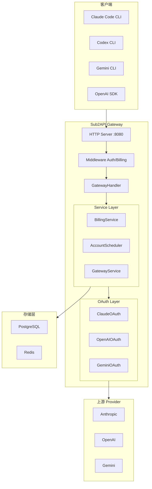

# Sub2API 项目审计总结

> 本文档由 GitHub 开源项目审计流程生成，包含 Step 1-5 的完整分析结果。

---

## Step 1: Project Scan（项目扫描）

### 项目基本信息

| 项目 | 值 |
|------|-----|
| **项目名称** | Sub2API |
| **一句话介绍** | AI API 网关平台，用于分发和管理 AI 产品订阅的 API 配额 |
| **License** | GNU LGPL v3.0 |
| **维护状态** | 活跃维护中 |
| **主要语言** | Go（后端）、Vue/TypeScript（前端） |

### 主要功能

- 多账号管理（支持 OAuth、API Key 类型的上游账号）
- API Key 分发与用户管理
- Token 级别精确计费和用量追踪
- 智能账号调度（支持粘性会话）
- 并发控制与速率限制
- 内置支付系统（支付宝、微信、Stripe、EasyPay）
- 管理后台 Web 界面
- 支持 Grok/xAI OAuth、Antigravity、Gemini 等多种 Provider

### 技术栈

| 组件 | 技术 |
|------|------|
| 后端 | Go 1.26+, Gin, Ent (ORM), Wire (DI) |
| 前端 | Vue 3.4+, Vite 5+, TailwindCSS |
| 数据库 | PostgreSQL 15+ |
| 缓存 | Redis 7+ |
| 其他 | JWT, WebSocket, SSE, Cron |

### 项目特点

| 项目 | 结果 |
|------|------|
| 是否前后端分离 | ✅ 是 |
| 是否需要数据库 | ✅ PostgreSQL 15+ |
| 是否支持 Docker | ✅ Docker Compose |
| 是否支持本地开发 | ✅ go run + pnpm dev |
| 推荐运行环境 | Go 1.21+, Node 18+, PostgreSQL 15+, Redis 7+ |

---

## Step 2: Architecture Scan（架构扫描）

### 整体架构

Sub2API 采用 **前后端分离 + 微服务化** 架构，核心是一个 **AI API Gateway**：

```
用户请求 → API Gateway → Account Pool (Scheduler) → 上游 Provider → 响应
         ↓               ↓                           ↓
         鉴权/计费      智能调度                   Token/OAuth 认证
```

### 目录结构

| 目录 | 作用 |
|------|------|
| `backend/cmd/server/` | 服务入口、Wire 依赖注入、启动流程 |
| `backend/ent/` | 数据库实体定义（ORM Schema） |
| `backend/internal/config/` | 配置管理（YAML + 环境变量） |
| `backend/internal/domain/` | 业务领域常量与类型定义 |
| `backend/internal/handler/` | HTTP 处理器（路由层） |
| `backend/internal/service/` | 核心业务逻辑（Account Pool、OAuth、调度） |
| `backend/internal/repository/` | 数据访问层（Redis 缓存 + PostgreSQL） |
| `backend/internal/pkg/` | 公共工具包（OAuth、HTTP Client、日志等） |
| `backend/internal/server/` | HTTP 服务器、中间件、路由注册 |
| `frontend/src/` | Vue 3 前端（管理后台） |

### 启动入口

- **后端入口**：`backend/cmd/server/main.go`
- 启动流程：检查 Setup → 加载配置 → Wire DI → HTTP Server

### API 路由

| 路径 | 功能 | 平台 |
|------|------|------|
| `/v1/messages` | Anthropic Messages API | Claude/Grok/Antigravity |
| `/v1/responses` | OpenAI Responses API | OpenAI/Grok |
| `/v1/chat/completions` | OpenAI Chat Completions | OpenAI/Grok |
| `/v1beta/models/*` | Gemini Native API | Gemini |
| `/antigravity/v1/messages` | Antigravity Claude | Antigravity |
| `/backend-api/codex/responses` | Codex CLI 兼容 | OpenAI |

### OAuth 模块

| 平台 | 实现文件 |
|------|----------|
| Claude/Anthropic | `internal/service/oauth_service.go` |
| OpenAI | `internal/service/openai_oauth_service.go` |
| Gemini | `internal/service/gemini_oauth_service.go` |
| Grok/xAI | `internal/service/grok_oauth_service.go` |
| Antigravity | `internal/service/antigravity_oauth_service.go` |

### Account Pool

- **调度器**：`internal/service/openai_account_scheduler.go`
- **缓存**：`internal/repository/scheduler_cache.go`（Redis 快照）
- **调度策略**：粘性会话、负载均衡、配额感知、故障转移

### Provider 支持

| Provider | Service 文件 | 认证方式 |
|----------|-------------|----------|
| Anthropic Claude | `gateway_service.go` | OAuth / API Key |
| OpenAI | `openai_gateway_service.go` | OAuth / PAT |
| Gemini | `gemini_session.go` | OAuth |
| Grok/xAI | `grok_token_provider.go` | OAuth (PKCE) |
| Antigravity | `antigravity_gateway_service.go` | OAuth |
| Bedrock | `bedrock_request.go` | AWS Signature |

---

## Step 3: Environment Preparation（环境准备）

### 环境检查结果

| 工具 | 要求版本 | 本机版本 | 状态 |
|------|----------|----------|------|
| Go | 1.21+ | 1.26.4 | ✅ |
| Node.js | 18+ | 22.23.0 | ✅ |
| pnpm | 最新 | 11.10.0 | ✅ (corepack) |
| PostgreSQL | 15+ | 18.4 | ✅ |
| Redis | 7+ | 未安装 | ⚠️ 需安装 |

### 依赖安装结果

| 依赖 | 结果 |
|------|------|
| Go modules | ✅ `go mod download` 成功 |
| Frontend | ✅ `pnpm install` 成功（972 packages） |

### 存在问题

1. **Redis 未安装**：需启动 Redis 服务
2. **pnpm 警告**：deprecated packages，不影响运行

---

## Step 4: Local Run（本地启动）

### 启动命令

**方式 1：后端开发模式**
```bash
cd backend
go run ./cmd/server
```

**方式 2：前端开发模式**
```bash
cd frontend
pnpm run dev
```

**方式 3：完整构建**
```bash
cd frontend && pnpm run build
cd backend && go build -tags embed -o sub2api ./cmd/server
./sub2api
```

### 预期结果

| 项目 | 值 |
|------|-----|
| 监听端口 | 8080 |
| 访问地址 | http://localhost:8080 |
| Setup Wizard | 首次运行时显示 |

### 前置准备

1. 启动 PostgreSQL
2. 启动 Redis（`docker run -d --name redis -p 6379:6379 redis:7-alpine`）
3. 创建数据库（`CREATE DATABASE sub2api;`）

---

## Step 5: Source Code Walkthrough（源码导览）

### 请求流程

```
HTTP Request → main() → Wire DI → HTTP Server
    ↓
Middleware Chain: Body Limit → CORS → Auth → Billing
    ↓
Handler: GatewayHandler.Messages()
    ↓
Service: BillingCache → Concurrency → AccountScheduler → GatewayService
    ↓
Account Pool (Redis): Sticky Session → Load Balance → Quota Aware
    ↓
OAuth Token Provider: Claude/OpenAI/Gemini/Grok/Antigravity
    ↓
Upstream Provider HTTP Call: Anthropic/OpenAI/Gemini/xAI/Antigravity
    ↓
Response: SSE Stream → Token Count → Usage Billing (async)
```

### 模块职责

| 层级 | 职责 |
|------|------|
| **入口** | 启动流程、Setup Wizard、Wire DI |
| **HTTP** | HTTP Server 配置、h2c 支持 |
| **路由** | 路由注册、平台分发 |
| **中间件** | API Key 验证、用户绑定、计费检查 |
| **Handler** | 请求解析、错误处理、响应格式化 |
| **Service** | 核心网关逻辑、请求转发、流处理 |
| **调度** | 账号选择、粘性会话、负载均衡 |
| **OAuth** | Token 获取、刷新、存储 |
| **缓存** | Account Pool Redis 快照 |
| **计费** | Token 计费、余额扣除 |
| **用量** | 用量记录、异步写入 |

### 核心设计模式

1. **依赖注入**：Google Wire 自动生成依赖图
2. **分层架构**：Handler → Service → Repository 清晰分离
3. **Account Pool**：Redis 快照 + 负载感知调度
4. **粘性会话**：Session Hash 绑定同一账号
5. **异步计费**：Worker Pool 批量写入用量日志
6. **故障转移**：账号失败时自动切换

### Mermaid 架构图



### 项目优点

1. **架构清晰**：分层明确，依赖注入，易于测试
2. **多平台支持**：一个网关同时支持 5+ AI 平台
3. **智能调度**：粘性会话 + 负载均衡 + 配额感知
4. **高可用设计**：故障转移、自动 Token 刷新、并发控制
5. **完整计费系统**：Token 级计费、内置支付、订阅管理
6. **生产就绪**：完善的 CI/CD、Docker 支持、Setup Wizard

### 值得学习的文件

| 设计点 | 文件 |
|--------|------|
| Wire DI | `backend/cmd/server/wire.go` |
| Account Scheduler | `backend/internal/service/openai_account_scheduler.go` |
| Token Refresher | `backend/internal/service/token_refresher.go` |
| Gateway Service | `backend/internal/service/gateway_service.go` |
| Route Dispatch | `backend/internal/server/routes/gateway.go` |

---

## 总结

Sub2API 是一个 **生产级 AI API Gateway**，具备：

- ✅ 完善的多平台兼容（Anthropic/OpenAI/Gemini/Grok/Antigravity）
- ✅ 智能账号调度与粘性会话
- ✅ 精确 Token 计费与内置支付系统
- ✅ 高可用设计（故障转移、并发控制）
- ✅ 清晰的架构分层与依赖注入
- ✅ 完整的 CI/CD 与 Docker 支持

**适合场景**：
- AI SaaS 平台搭建
- 多账号订阅配额分发
- API Key 管理与计费系统
- 学习网关架构设计

---

*审计完成时间：2026-07-07*